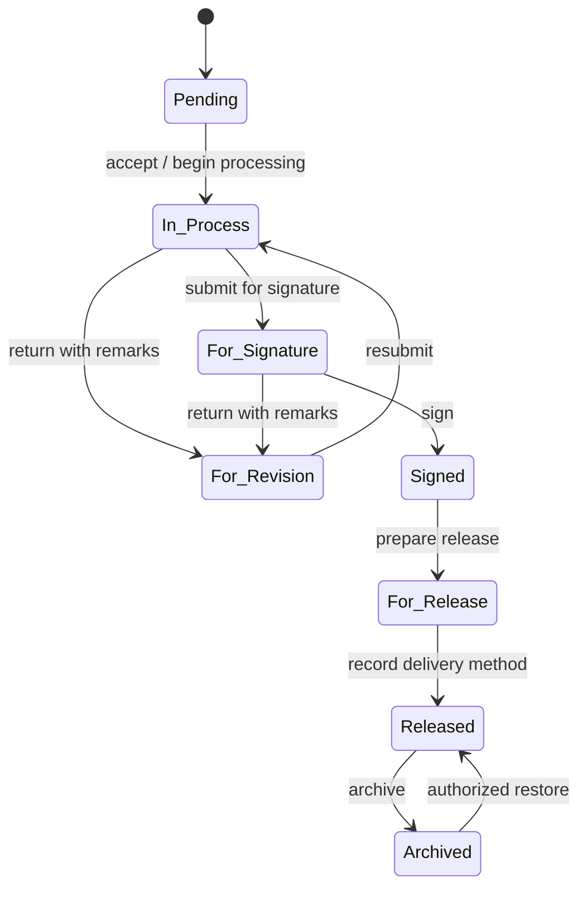
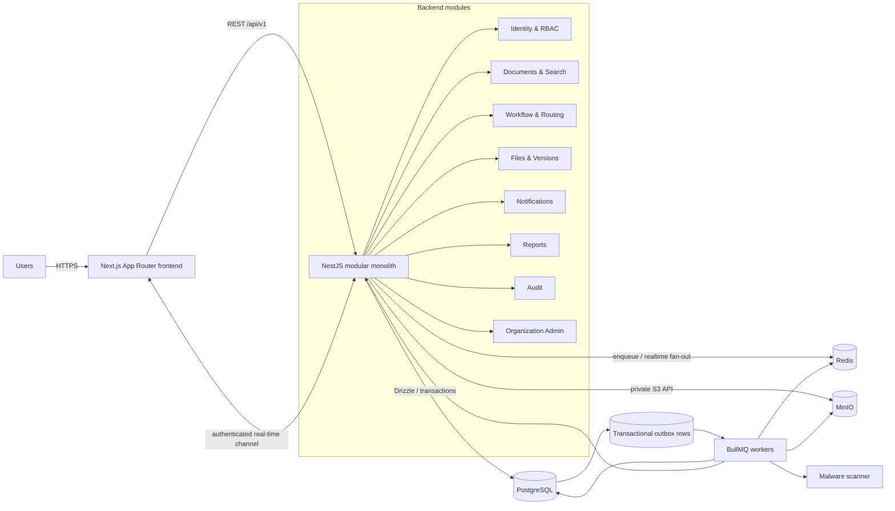
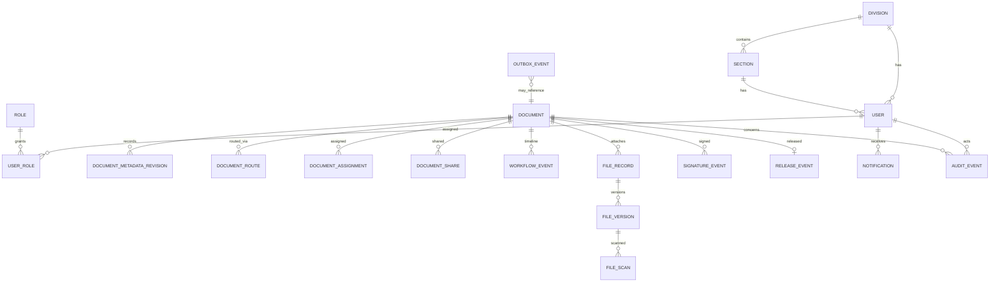

# Document Management and Tracking System

> **Document status:** Implementation plan and architecture baseline  
> **Audience:** Product owner, records office, pilot division, software engineer, and organization IT  
> **Planning basis:** The attached problem statement and 75 user stories, plus the 151 decisions agreed during the DTS planning interview  
> **Delivery assumption:** One full-stack software engineer, 20–25 hours/week, with no hard deadline

## How to read this document

This plan deliberately separates three kinds of statements:

- **[Source]** — stated in the attached DTS brief/user stories. Source terminology is retained (for example, *Pending*, *In-Process*, *For-Revision*, *For Signature*, *Signed*, *For Release*, *Released*, and *Archived*).
- **[Decision D-n]** — part of the 151-item agreed design baseline. The complete register is in §1.10 so decisions are traceable rather than silently converted into assumptions.
- **[Estimate]** — an engineering forecast, sequencing choice, or implementation detail that must be validated during delivery.
- **[Policy validation]** — a business, legal, records-management, or security rule that remains intentionally unresolved.

# 1. Project Overview

## 1.1 Problem

**[Source]** Government bureaus and organizations currently rely on physical routing slips, paperwork on desks, and scattered email chains. This creates poor visibility into where a document is in its lifecycle, what is pending or overdue, who is accountable, and whether service-level deadlines (including applicable Philippine Anti-Red Tape Act processing times) are being met. Documents can be delayed or lost, and reporting on throughput is difficult.

## 1.2 Product goal

**[Source]** Build a modern web-based Document Management and Tracking System (DTS) that digitizes the lifecycle from creation through review, signature, release, and archival. It becomes the single source of truth for document metadata, files, routing, status, remarks, accountability, deadlines, notifications, and reports.

**[Decision D-1–D-8]** The MVP is an operational tracking and controlled-file system, not a general-purpose enterprise content-management platform. It must make the full predefined workflow usable in production, preserve immutable file versions, scan uploads for malware, and provide durable real-time notifications.

## 1.3 Goals and success measures

| Goal | MVP success indicator |
|---|---|
| Replace opaque routing | Authorized users can see current owner, division/section, status, timestamps, and full timeline for every accessible document. |
| Standardize processing | Only allowed transitions in the predefined workflow can be executed; every transition records actor, time, and remarks. |
| Improve accountability | Audit records are append-only at the application boundary and cover authentication, administration, document, file, routing, workflow, notification, and report actions. |
| Reduce missed deadlines | Configured due dates/SLA targets are visible; overdue work is highlighted and reportable. Exact statutory/business calendars remain configuration and policy work. |
| Protect records | Every uploaded revision creates a new immutable file version, is quarantined until malware scanning succeeds, and is never overwritten in place. |
| Make work discoverable | Metadata search supports title, reference number, sender, and company, with source-defined filters and sorting. |
| Support oversight | Records staff can produce core monthly PDF and XLSX reports and printable routing slips. |
| Prove pilot readiness | Records office plus one division complete acceptance testing and operate the organization-hosted pilot with documented backup/restore and support procedures. |

## 1.4 Users and access scope

| User/persona | Primary responsibilities | Default scope |
|---|---|---|
| Administrator | Approve/create/deactivate users; assign roles/divisions/sections; manage organization structure; investigate audit trail; administer documents where authorized | Organization-wide administrative scope |
| Records staff | Register incoming/outgoing correspondence; monitor all documents; generate reports; support routing and release | Organization-wide document visibility |
| Division head | Accept, assign, route, review, return for revision, sign, and release | Own division and its sections, plus explicitly shared documents |
| Staff member | Create and process documents, upload versions, add remarks, perform allowed actions | Own division/section, plus explicitly shared documents |
| Viewer | Read accessible documents and timelines without modifying them | Own division, plus explicitly shared documents |
| Auditor/authorized administrator | Search and review audit evidence | Explicitly granted organization-wide audit scope |

**[Decision]** Authorization is enforced by the API, not merely hidden in the user interface. Role, organizational scope, assignment, sharing, document direction, and workflow state all participate in authorization decisions.

## 1.5 Core workflow

**[Source; Decision D-46–D-61]** The MVP ships with the full predefined workflow:



Rules:

- The server publishes and enforces allowed next actions for the current user and document state.
- A transition is atomic with its timeline event, audit event, routing/assignment changes, and transactional-outbox entries.
- Remarks are captured for context; return-for-revision requires a remark.
- Outgoing documents require at least one clean attachment and a signature before release.
- Release records the delivery method: mailed, emailed, picked up, or delivered.
- Parallel forwarding to multiple divisions creates traceable route/assignment records without cloning the canonical document.
- Archival removes a document from active work queues but does not delete its history or files. Authorized restoration returns it to *Released*.
- Administrative deletion is not implemented as an untracked hard delete. MVP uses a controlled logical deletion/tombstone with reason and audit evidence; final deletion/disposal rules require records policy approval.

## 1.6 MVP scope

The MVP includes the capabilities required for a real pilot, not placeholder screens:

1. **Identity and administration:** account requests, approval/rejection, administrator-created accounts, email/password login, bcrypt password hashing, inactivity logout, profile photo, user deactivation, roles, divisions, and sections.
2. **Dashboard:** accessible metrics, pending and overdue counts, pending-by-division chart, recent activity, and quick accept/assign actions, all scoped by authorization.
3. **Document registry:** incoming/outgoing creation; source-defined metadata; generated outgoing reference numbers; editable metadata with audit history; pagination, sorting, filtering, and metadata search.
4. **Workflow and routing:** the complete predefined workflow, legal-transition enforcement, assignments, section routing, multi-division forwarding, signing, revision, release, archive, restore, remarks, and timeline.
5. **Files:** multiple attachments, PDF/image inline preview, immutable file versions, checksums, MinIO object storage, upload quarantine, malware scanning in MVP, and clean/infected/error states.
6. **Notifications:** persisted in-app notifications, unread badge, mark-as-read, real-time delivery, reconnect/catch-up, and durable background processing through Redis/BullMQ and a transactional outbox.
7. **Reports and printing:** monthly incoming/outgoing/FOI/special-order totals, month/year filters, print view, core PDF and XLSX exports, and branded routing slips containing timeline, remarks, and statuses.
8. **Audit and operations:** immutable application audit log, filters, health checks, structured logging, database/object backup and tested restore, deployment documentation, and organization-hosted pilot.
9. **Pilot:** records office plus one division, named pilot users, training, acceptance testing, issue triage, and go/no-go gate.

## 1.7 Deferred later phases

The following are explicitly outside the MVP unless pilot evidence changes priority:

- Enterprise SSO/MFA, conditional access, device posture, and centralized identity-provider integration.
- Advanced security operations integrations (SIEM forwarding, automated anomaly detection, privileged-access workflows, DLP, and advanced key management).
- **Break-glass evidence-retention workflow.** The capability and its retention rules are deferred; it must not be improvised in the MVP.
- OCR, full-text content indexing, semantic search, and document-content analytics. MVP search is metadata search.
- User-configurable workflow designer. MVP uses the predefined full workflow.
- Native mobile applications; the web UI remains responsive.
- External portals, public tracking, e-signature-provider integration, email/SMS notification channels, bulk migration, and broad organization rollout.
- Advanced records disposition/legal holds until records schedules and approval authority are defined.
- Expanded analytics beyond the core operational PDF/XLSX reports.

## 1.8 MVP acceptance criteria

The MVP is acceptable only when all of the following pass in a pilot-like environment:

1. A records user can create incoming and outgoing documents with required metadata; outgoing reference generation is unique under concurrent requests.
2. An outgoing document cannot be released without a clean attachment and recorded signature.
3. Every legal workflow path—including revision loops, archive, and authorized restore—works; illegal transitions are rejected by the API and covered by tests.
4. Division/section scope, explicit sharing, roles, and viewer read-only restrictions are verified with an authorization matrix and negative tests.
5. Files are private by default; upload creates an immutable version, computes a checksum, quarantines the object, scans it, and exposes it only after a clean result. Infected or scan-failed files never become downloadable.
6. A user can locate accessible records using title, reference number, sender, or company and apply status, priority, type, direction, division, section, sorting, and pagination.
7. Assignment and relevant workflow events create persisted notifications; connected clients receive them in real time, and disconnected clients receive them after reconnect/login without duplicates.
8. Monthly reports reconcile to seeded/verified source data and export to valid PDF and XLSX files; routing slips print with organization branding and complete visible timeline data.
9. Audit events identify actor, action, target, timestamp, outcome, and correlation identifier. Normal application roles cannot modify or delete them.
10. Dashboard numbers match underlying authorized document queries and never leak cross-division data.
11. The supported browsers and responsive layouts pass keyboard, focus, semantic-label, reduced-motion, loading, empty, error, and success-state checks.
12. Rate limiting, validation, secure headers/CORS, password hashing, session expiry, file restrictions, and authorization checks pass the security checklist.
13. Database and MinIO backup/restore is demonstrated in the pilot environment; recovery steps and ownership are documented.
14. Records office plus one division complete agreed user-acceptance scenarios, training, and a go/no-go review; no open severity-1 defects remain.
15. The product owner and records-policy owner review the open-policy register, including indefinite audit retention; unresolved policy is not silently encoded as permanent behavior.

## 1.9 Open policy and product questions

These are intentionally not assumptions:

| Topic | MVP handling | Required owner/decision |
|---|---|---|
| Audit retention | Preserve audit events indefinitely for the pilot; do not implement automated purge | **[Policy validation]** Records/legal must validate whether indefinite retention is lawful and appropriate, and define disposition/export rules. |
| Document/file retention and deletion | Logical deletion/tombstone only; no physical purge through ordinary UI | Records/legal schedule, disposal authority, holds, and recovery window |
| Break-glass evidence retention | Deferred | Security, records, legal, and privacy design for authorization, evidence contents, access, retention, and review |
| SLA calculation | Configurable target/due date and overdue indicator | Applicable service classes, start/pause/stop events, working calendar, holidays, escalation, and authoritative ARTA interpretation |
| Signature meaning | Record an internal approval/signature action and signer identity | Whether a scanned signature, approval attestation, or qualified external e-signature is legally required |
| Reference-number format | Division-based, generated atomically | Exact format, reset period, prefixes, and correction procedure |
| Organization branding | Configurable name/seal on routing slip/report | Approved assets and print template sign-off |
| File policy | Configurable allowlist and size limits; scan every upload | Approved MIME types, maximum sizes, encrypted-file handling, and infected-file retention/disposal |

## 1.10 Agreed design decision register (D-1 through D-151)

This register preserves the complete decision baseline. It is grouped for readability, but identifiers remain stable. A future change should supersede a decision explicitly instead of silently rewriting it.

### Product and delivery (D-1–D-15)

1. **D-1:** Deliver a web-based DTS as the single operational source of truth.
2. **D-2:** Target government bureau/organization document routing and accountability.
3. **D-3:** Preserve the source lifecycle terminology in UI, API mappings, reports, and training.
4. **D-4:** Build an MVP suitable for a controlled operational pilot, not a throwaway prototype.
5. **D-5:** Pilot with the records office plus one division.
6. **D-6:** Use one full-stack engineer at 20–25 hours/week as the planning capacity.
7. **D-7:** Apply no hard deadline; quality gates determine progression.
8. **D-8:** Include an explicit 20–30% schedule contingency.
9. **D-9:** Implement by vertical slices that include UI, API, persistence, authorization, tests, and observability.
10. **D-10:** Treat the attached problem statement and user stories as product source, not complete policy.
11. **D-11:** Label engineering estimates separately from source requirements and agreed decisions.
12. **D-12:** Prefer the smallest coherent MVP that supports the entire predefined workflow.
13. **D-13:** Defer advanced security enhancements that are not required for safe pilot operation.
14. **D-14:** Document unresolved policy rather than inventing it.
15. **D-15:** Require records-office and pilot-division acceptance before wider rollout.

### Users, identity, and authorization (D-16–D-35)

16. **D-16:** Support account requests from the login experience.
17. **D-17:** Require administrator approval or rejection of account requests.
18. **D-18:** Permit administrators to create accounts directly.
19. **D-19:** Assign roles, division, and section during onboarding.
20. **D-20:** Support account deactivation without erasing historical identity.
21. **D-21:** Use email and password for MVP authentication.
22. **D-22:** Hash passwords with bcrypt using a reviewed work factor.
23. **D-23:** Enforce inactivity-based session expiration.
24. **D-24:** Rate-limit login and other abuse-sensitive endpoints.
25. **D-25:** Allow profile photos with the same safe file-handling principles.
26. **D-26:** Use server-enforced role-based access control.
27. **D-27:** Model Administrator, Records Staff, Division Head, Staff Member, and Viewer roles.
28. **D-28:** Give Administrator and Records Staff organization-wide document visibility, subject to action-specific permissions.
29. **D-29:** Limit Division Heads to their division and explicitly shared documents.
30. **D-30:** Limit Staff Members to their division/section, assignments, and explicitly shared documents.
31. **D-31:** Keep Viewer access read-only.
32. **D-32:** Combine role, organization scope, assignment/share, and document state for authorization.
33. **D-33:** Apply authorization to reads, search results, counts, exports, files, and real-time events—not only mutations.
34. **D-34:** Keep user, role, division, and section administration auditable.
35. **D-35:** Defer enterprise SSO/MFA integration to a later security phase.

### Organization, documents, and metadata (D-36–D-45)

36. **D-36:** Model divisions and their sections as administered organizational units.
37. **D-37:** Associate users with a division and, where applicable, a section.
38. **D-38:** Support incoming and outgoing document directions.
39. **D-39:** Record title, type, description, priority, direction, sender/company, references, and organizational routing metadata as applicable.
40. **D-40:** Preserve the external sender reference number for incoming documents.
41. **D-41:** Generate unique outgoing reference numbers based on division rules.
42. **D-42:** Make reference-number allocation atomic and concurrency-safe.
43. **D-43:** Permit authorized metadata corrections while retaining audit evidence.
44. **D-44:** Support pagination and sorting for document lists.
45. **D-45:** Treat administrative removal as audited logical deletion pending an approved disposition policy.

### Workflow and routing (D-46–D-67)

46. **D-46:** Ship the predefined full workflow in the MVP.
47. **D-47:** Use *Pending* as the initial workflow state.
48. **D-48:** Support *Pending → In-Process*.
49. **D-49:** Support *In-Process → For-Revision*.
50. **D-50:** Support *For-Revision → In-Process*.
51. **D-51:** Support *In-Process → For Signature*.
52. **D-52:** Support *For Signature → For-Revision*.
53. **D-53:** Support *For Signature → Signed*.
54. **D-54:** Support *Signed → For Release*.
55. **D-55:** Support *For Release → Released*.
56. **D-56:** Support *Released → Archived*.
57. **D-57:** Permit authorized *Archived → Released* restoration.
58. **D-58:** Reject all transitions not present in the approved state/action matrix.
59. **D-59:** Return allowed next actions from the API for the current actor.
60. **D-60:** Record actor, timestamp, status/action, and remarks in the document timeline.
61. **D-61:** Require remarks when returning a document for revision.
62. **D-62:** Route documents to divisions and sections.
63. **D-63:** Allow authorized users to accept and assign pending documents.
64. **D-64:** Allow traceable forwarding to multiple divisions for collaboration.
65. **D-65:** Keep one canonical document while recording parallel routes/assignments.
66. **D-66:** Record signature and signer before an outgoing document can progress to release.
67. **D-67:** Record mailed, emailed, picked up, or delivered as the release method.

### Files and content safety (D-68–D-83)

68. **D-68:** Allow multiple files per document.
69. **D-69:** Store binary objects in MinIO using its S3-compatible API.
70. **D-70:** Store file metadata and version relationships in PostgreSQL.
71. **D-71:** Make every file version immutable.
72. **D-72:** Never overwrite an existing object when a user uploads a revision.
73. **D-73:** Assign stable file identity and monotonically increasing version identity.
74. **D-74:** Compute and retain a cryptographic checksum for every uploaded version.
75. **D-75:** Keep object storage private and issue only authorized, short-lived access.
76. **D-76:** Validate filename, declared type, detected type, size, and configured allowlist.
77. **D-77:** Place every upload in quarantine before use.
78. **D-78:** Perform malware scanning in the MVP.
79. **D-79:** Expose/download/preview a file only after a clean scan result.
80. **D-80:** Quarantine infected, error, timeout, or indeterminate scan results fail-closed.
81. **D-81:** Audit upload, version creation, scan result, preview, download, and administrative handling.
82. **D-82:** Provide inline preview for clean PDFs and images.
83. **D-83:** Require at least one clean attachment before releasing an outgoing document.

### Search, dashboard, and usability (D-84–D-99)

84. **D-84:** Implement metadata search in the MVP.
85. **D-85:** Search title, reference number, sender, and company.
86. **D-86:** Filter by status, priority, type, direction, division, and section.
87. **D-87:** Sort by date, priority, or status.
88. **D-88:** Scope search, filter values, counts, and facets through authorization.
89. **D-89:** Defer OCR and full-text content search.
90. **D-90:** Show key document metrics on the dashboard.
91. **D-91:** Show the authorized pending count for the user's division/scope.
92. **D-92:** Highlight overdue documents.
93. **D-93:** Chart pending documents by division for users allowed to see the aggregation.
94. **D-94:** Show a scoped recent-activity feed.
95. **D-95:** Support dashboard quick actions for accept/assign.
96. **D-96:** Build a responsive web interface rather than native mobile apps.
97. **D-97:** Preserve keyboard navigation and semantic, accessible markup.
98. **D-98:** Respect reduced-motion preferences.
99. **D-99:** Add keyboard shortcuts only where discoverable and non-conflicting.

### Notifications and asynchronous work (D-100–D-113)

100. **D-100:** Persist notifications in PostgreSQL before delivery.
101. **D-101:** Notify users when documents are assigned or require their attention.
102. **D-102:** Provide unread count and mark-as-read behavior.
103. **D-103:** Deliver notification updates in real time to connected clients.
104. **D-104:** Make real-time delivery durable through reconnect/catch-up from persisted state.
105. **D-105:** Use Redis and BullMQ for background jobs.
106. **D-106:** Use a transactional outbox so state changes and event intent commit atomically.
107. **D-107:** Publish outbox entries asynchronously with retry and backoff.
108. **D-108:** Make consumers/jobs idempotent and safe under at-least-once delivery.
109. **D-109:** Track attempts, failures, and dead-letter/failed jobs for operations.
110. **D-110:** Prevent unauthorized event payloads from crossing user/division boundaries.
111. **D-111:** Use toast messages for immediate action feedback but not as the durable record.
112. **D-112:** Reconcile unread counts from the server after reconnect.
113. **D-113:** Defer email and SMS notification channels.

### Reports, audit, and policy (D-114–D-129)

114. **D-114:** Produce the core monthly operational report.
115. **D-115:** Include incoming, outgoing, FOI request, and special-order totals.
116. **D-116:** Filter monthly reports by month and year.
117. **D-117:** Export core reports to PDF.
118. **D-118:** Export core reports to XLSX.
119. **D-119:** Provide print-friendly reports.
120. **D-120:** Generate a branded printable routing slip.
121. **D-121:** Include timeline, remarks, and status at each step on the routing slip.
122. **D-122:** Require server-side authorization when generating every report/export.
123. **D-123:** Record report/export generation in the audit trail.
124. **D-124:** Maintain an application-level immutable, append-only audit trail.
125. **D-125:** Cover authentication, administration, document, workflow, routing, file, report, and security-relevant actions.
126. **D-126:** Support audit filtering by user, action type, and date range.
127. **D-127:** Preserve audit events indefinitely during the pilot.
128. **D-128:** Flag indefinite audit retention for records/legal/privacy policy validation.
129. **D-129:** Defer break-glass evidence retention and its policy to a later security phase.

### Architecture, deployment, quality, and rollout (D-130–D-151)

130. **D-130:** Build the backend as a modular monolith using NestJS and TypeScript.
131. **D-131:** Expose a versioned REST API.
132. **D-132:** Build a separate Next.js frontend using the App Router.
133. **D-133:** Use PostgreSQL as the system-of-record database.
134. **D-134:** Use Drizzle for typed schema access and migrations.
135. **D-135:** Use Redis/BullMQ for queued background processing.
136. **D-136:** Use MinIO as S3-compatible object storage.
137. **D-137:** Organize the backend by cohesive domain modules with explicit interfaces.
138. **D-138:** Keep frontend/API contracts explicit and validated at runtime boundaries.
139. **D-139:** Validate all API input and use centralized safe error responses.
140. **D-140:** Restrict CORS to configured authorized frontend origins.
141. **D-141:** Use local Docker Compose for repeatable development.
142. **D-142:** Deploy the pilot on organization-hosted infrastructure.
143. **D-143:** Separate environment configuration and secrets from source control.
144. **D-144:** Provide health/readiness checks and structured, correlation-aware logs.
145. **D-145:** Back up PostgreSQL and MinIO together under a documented recovery procedure.
146. **D-146:** Test restore before pilot go-live.
147. **D-147:** Add unit, integration, API authorization, worker, and critical end-to-end tests.
148. **D-148:** Gate releases on lint, type checking, tests, build, migration validation, and security review.
149. **D-149:** Seed realistic non-sensitive pilot/UAT data and maintain repeatable test fixtures.
150. **D-150:** Train pilot users, collect feedback, triage defects, and hold a formal go/no-go review.
151. **D-151:** Expand beyond records office plus one division only after pilot acceptance, operational readiness, and policy review.

# 2. Technical Architecture

## 2.1 Architecture style

**[Decision D-130–D-138]** Use a modular monolith for the API and background-worker codebase. This preserves transactional consistency and keeps deployment manageable for a single engineer while enforcing module boundaries that can later be separated if evidence warrants it. The Next.js frontend is a separately deployed application and communicates only through the versioned REST API and authenticated real-time channel.



## 2.2 Deployable components

| Component | Responsibility | Scaling/reliability notes |
|---|---|---|
| Next.js frontend | App Router pages/layouts, accessible UI, server/client rendering as appropriate, API client, real-time updates | Stateless; no authorization decision is trusted solely to it |
| NestJS API | Authentication, authorization, validation, domain commands/queries, REST, real-time gateway, transaction boundaries | Modular monolith; horizontally scalable after shared session/realtime strategy is validated |
| Worker process | Outbox publication, notification delivery, malware scans, report generation, retries | Same codebase/domain contracts; separately run process; idempotent jobs |
| PostgreSQL | Authoritative metadata, workflow, routes, notifications, audit, outbox | ACID transactions, constraints, indexed authorized queries, tested backups |
| Redis/BullMQ | Job queue, retry scheduling, real-time fan-out coordination | Not the system of record; loss must not erase committed notification intent |
| MinIO | Private attachment and generated-export objects | Version objects never overwritten; backup coordinated with database metadata |
| Malware scanner | Scan quarantined uploads | Fail closed; signature updates and health are operational requirements |
| Reverse proxy/TLS endpoint | HTTPS termination, request limits, routing | Organization-controlled certificates, logs, and network rules |

## 2.3 Backend module boundaries

- **Identity:** account requests, credentials, sessions/tokens, profile, user lifecycle.
- **Authorization:** roles, permissions, organization scope, document policy checks. Exposes policy functions/guards; does not depend on controllers.
- **Organization:** divisions, sections, memberships, reference-number configuration.
- **Documents:** canonical record and metadata; incoming/outgoing rules; authorized queries and metadata search.
- **Workflow:** state machine, allowed actions, transition validation, timeline events, signatures, release, archive/restore.
- **Routing:** assignments, division/section routes, explicit sharing, parallel-route completion.
- **Files:** upload sessions, immutable versions, checksums, quarantine, scan state, authorization, preview/download access.
- **Notifications:** notification records, audience resolution, read state, real-time delivery/catch-up.
- **Reports:** monthly aggregates, routing slips, PDF/XLSX generation, print models.
- **Audit:** append-only event writer and authorized search; called at domain/application boundaries.
- **Outbox/Jobs:** outbox capture, leasing/publication, idempotency, retries, failure inspection.

Modules exchange typed application commands/events rather than directly reaching into one another’s tables. Cross-module state-changing use cases are orchestrated in one PostgreSQL transaction where atomicity is required.

## 2.4 Request and event consistency

For a state-changing request such as “assign document”:

1. Validate input and authenticate the actor.
2. Authorize against role, organization scope, assignment/share, and document state.
3. Lock or conditionally update the relevant document/version to prevent lost updates.
4. In one PostgreSQL transaction, update the domain state, append timeline and audit events, create notification rows, and insert outbox rows.
5. Commit, then return the new representation and allowed actions.
6. A worker leases unpublished outbox rows, adds idempotent BullMQ jobs, and marks publication state.
7. Notification delivery updates connected clients. Offline clients later query persisted notifications using a cursor; Redis loss does not lose the committed notification.

Use an optimistic version column/ETag on editable aggregate roots. A stale update returns a conflict response instead of overwriting intervening work.

## 2.5 High-level data model



Key invariants:

- `document.reference_number` is unique within its approved numbering scope; allocation occurs transactionally.
- `document.workflow_status` is changed only by the workflow service/state machine.
- `workflow_event` is append-only and ordered per document.
- `file_version` rows and object keys are immutable; a unique `(file_record_id, version_number)` constraint prevents duplicates.
- A file version is usable only when `scan_status = CLEAN` and it has not been administratively restricted.
- Audit and outbox rows are inserted in the same transaction as the change they describe.
- Route, assignment, share, file, notification, report, and audit reads always apply authorization policy.

## 2.6 API shape

**[Engineering design consistent with decisions]** Version the API under `/api/v1`. Use resource-oriented reads and explicit action endpoints for stateful domain commands rather than allowing clients to set arbitrary statuses.

Representative endpoints:

```text
POST   /api/v1/auth/login
POST   /api/v1/account-requests
GET    /api/v1/documents
POST   /api/v1/documents
GET    /api/v1/documents/{id}
PATCH  /api/v1/documents/{id}/metadata
GET    /api/v1/documents/{id}/allowed-actions
POST   /api/v1/documents/{id}/actions/{action}
POST   /api/v1/documents/{id}/routes
POST   /api/v1/documents/{id}/files
POST   /api/v1/files/{fileId}/versions
GET    /api/v1/files/{fileId}/versions/{versionId}/content
GET    /api/v1/notifications
POST   /api/v1/notifications/{id}/read
GET    /api/v1/reports/monthly
GET    /api/v1/reports/monthly.pdf
GET    /api/v1/reports/monthly.xlsx
GET    /api/v1/documents/{id}/routing-slip.pdf
GET    /api/v1/audit-events
```

All list APIs use bounded pagination and deterministic ordering. Search terms are normalized and parameterized through Drizzle. Errors use a stable envelope with code, safe message, field details where appropriate, and correlation ID; internal stack traces are not returned.

## 2.7 Search

**[Decision D-84–D-89]** MVP search is PostgreSQL-backed metadata search. Normalize searchable fields, use appropriate B-tree/trigram or full-text indexes only for metadata after measuring query plans, and combine search with authorization predicates. Do not retrieve a broad result set and filter it in application memory. OCR and attachment-content indexing remain deferred.

## 2.8 Files and malware-scanning flow

1. API authorizes the upload and creates a pending upload/version record with a non-guessable object key.
2. The object is stored in a private quarantine prefix/bucket with size limits enforced at ingress.
3. Worker streams or submits the object to the malware scanner; it does not load unbounded files into memory.
4. Clean result updates the immutable version to `CLEAN` and makes authorized preview/download possible.
5. Infected result moves/restricts the object according to the approved operational procedure and records `INFECTED`; users receive a safe message.
6. Scanner error/timeout remains `SCAN_FAILED` or `PENDING_RETRY`; access stays blocked.
7. Retry is bounded and observable. Administrative retry/disposition is permissioned and audited.

Preview responses use safe content-disposition/content-type headers, short-lived authorization, anti-sniffing headers, and a restrictive Content Security Policy. Active file types are not rendered inline.

## 2.9 Authentication, RBAC, and security baseline

- Bcrypt password hashing; never log credentials or session tokens.
- Secure, HTTP-only, same-site cookies are the preferred browser session transport; if the implementation uses access/refresh tokens, refresh rotation and revocation must be specified and tested before adoption.
- CSRF protection appropriate to the chosen cookie/session model.
- Rate limiting for login, account request, upload, report, and other abuse-sensitive paths.
- Runtime request validation, output shaping, parameterized database access, upload limits, and filename/path isolation.
- Exact configured CORS origin allowlist; no wildcard with credentials.
- Security headers, TLS, sanitized logs, least-privilege database/object credentials, and secrets supplied through the deployment environment.
- Deny-by-default authorization with tests for cross-division identifiers, direct file URLs, list/count/report leakage, and real-time subscription leakage.
- Audit security-relevant success and failure outcomes without storing secrets or unnecessary file content.
- Dependency and container scanning before pilot; patching and incident ownership documented.

Later-phase security enhancements include enterprise SSO/MFA, SIEM integration, advanced key management, DLP, anomaly detection, and the separately designed break-glass/evidence-retention capability.

## 2.10 Reports and audit

Report queries operate on an explicit reporting definition and authorized scope. Generated PDF/XLSX artifacts have bounded retention or are regenerated on demand once policy is approved. Workbook cells derived from user-controlled text must be protected against spreadsheet formula injection.

Audit events contain at least event ID, occurred-at timestamp, actor/user ID (or system actor), action, target type/ID, outcome, correlation ID, source context appropriate to policy, and a structured summary of relevant changes. Application code exposes insert and query operations—not update/delete operations—to ordinary runtime roles. Database privileges and backups reinforce this boundary.

**[Policy validation]** “Immutable” at application level does not by itself define regulatory evidentiary sufficiency. Tamper-evident chaining, write-once storage/export, external timestamping, and independent custody are later options only if policy/risk assessment requires them.

## 2.11 Local and pilot environments

### Local development

Docker Compose runs frontend, API, worker, PostgreSQL, Redis, MinIO, and a supported malware-scanning service. Provide health checks, persistent named volumes, migrations/seeds, non-secret development defaults, and a one-command documented startup path. Test fixtures must be synthetic and non-sensitive.

### Organization-hosted pilot

Use organization-controlled compute/networking with TLS, environment-specific secrets, restricted administration ports, persistent storage, resource limits, health/readiness probes, centralized logs, monitoring/alerts, and coordinated PostgreSQL/MinIO backups. Redis is treated as reconstructible; PostgreSQL and MinIO are restored consistently and verified. Deployment topology (VMs, containers, or an organization platform) is selected with IT during foundation work and is not assumed here.

## 2.12 Quality strategy

| Layer | Minimum coverage focus |
|---|---|
| Unit | Workflow transition matrix, authorization policies, reference-number rules, report calculations, file-state rules |
| Integration | Drizzle repositories/migrations, transactions/outbox, PostgreSQL constraints/indexes, MinIO adapter, Redis/BullMQ workers, scanner adapter |
| API | Validation, authentication/session behavior, every role/scope combination, concurrency conflicts, pagination/search, safe errors |
| End-to-end | Incoming/outgoing happy paths, revision loop, signature/release, archive/restore, file scan outcomes, durable notification reconnect, reports |
| Security | Horizontal/vertical authorization, brute force/rate limits, upload bypasses, path/object access, CORS/CSRF, formula injection, sensitive logging |
| Operational | Clean deployment, migrations, backup/restore, worker retry/failure recovery, scanner unavailable, Redis restart |
| Accessibility/usability | Keyboard/focus, semantic names, contrast, responsive layouts, reduced motion, loading/empty/error/success states |

# 3. Implementation Timeline

## 3.1 Estimation model

**[Estimate]** The plan uses 24 baseline delivery weeks plus 6 contingency/stabilization weeks: **30 weeks total at 20–25 hours/week (600–750 available hours)**. The six-week reserve is **25% of the 24-week baseline**, inside the agreed 20–30% contingency range. It is capacity for integration surprises, policy clarification, organization-hosting constraints, UAT findings, illness/leave, and security remediation—not pre-allocated feature scope.

There is no hard deadline. A week is a capacity bucket, not a promise that calendar time cannot move. Later phases begin only after the MVP pilot gate.

## 3.2 Dependency-aware phase plan

| Phase | Weeks | Outcome | Exit gate |
|---|---:|---|---|
| 0. Discovery and foundations | 1–3 | Confirm policy/configuration inputs; establish architecture, environments, CI, schema/migration discipline | Local stack reproducible; risks/owners recorded; skeleton checks pass |
| 1. Identity and organization | 4–6 | Secure login/onboarding, roles, divisions, sections, authorization framework | Auth/RBAC matrix passes positive and negative API tests |
| 2. First document vertical slice | 7–9 | Create, list, view, edit metadata, timeline, references, search foundation | Incoming/outgoing records work end to end with scoped access |
| 3. Full workflow and routing | 10–13 | Complete state machine, assignments, parallel routing, signature/release/archive | Every transition/action and scope path passes integration/E2E tests |
| 4. Immutable files and scanning | 14–16 | Multi-file/version upload, quarantine, scan, preview/download | Clean/infected/error paths proven; outgoing release invariant enforced |
| 5. Durable notifications and dashboard | 17–19 | Outbox, BullMQ, real-time/catch-up, metrics and quick actions | Restart/retry/reconnect tests prove no committed notification is lost |
| 6. Reports, audit, and print | 20–21 | PDF/XLSX reports, routing slips, audit filters | Reconciliation, authorization, export safety, and print review pass |
| 7. Hardening and pilot readiness | 22–24 | Accessibility, performance, security, backup/restore, deployment, training | Production-like test pass and pilot-readiness review approve UAT |
| Contingency and pilot stabilization | 25–30 | UAT, fixes, organization-hosted launch, observation, go/no-go | Records office and one division accept; operations and policy owners sign off |
| Later security/product phases | Post-MVP | Prioritized enhancements based on pilot risk/evidence | Separate scope, threat model, policy approval, and estimate |

## 3.3 Detailed weekly breakdown

### Week 1 — Source alignment and risk register

- Trace the 75 source user stories to D-1–D-151 and MVP/deferred scope.
- Run records-office and pilot-division workflow walkthroughs; confirm terms and actor responsibilities.
- Start the open-policy register: SLA rules, retention, deletion, signature meaning, numbering, branding, and file policy.
- **Tests/deliverables:** story-to-decision traceability, initial acceptance scenarios, risk register.
- **Gate:** product owner confirms the plan does not misstate source requirements or decided scope.

### Week 2 — Architecture and developer experience

- Establish repository/workspace structure for Next.js frontend and NestJS API/worker.
- Add TypeScript, formatting/linting, test runners, environment validation, and CI quality checks.
- Create local Docker Compose for PostgreSQL, Redis, MinIO, and malware scanner; document startup.
- **Tests/deliverables:** architecture record, runnable skeleton, health checks, CI smoke tests.
- **Gate:** a clean machine can run the stack using documented steps.

### Week 3 — Persistence, operations skeleton, and deployment spike

- Define Drizzle schema/migration conventions, IDs, timestamps, optimistic versions, audit/outbox foundations.
- Add structured logging, correlation IDs, health/readiness, safe errors, and configuration/secrets boundaries.
- With organization IT, validate pilot hosting, TLS, storage, backup, and scanner constraints.
- **Tests/deliverables:** initial migrations, migration rollback/recovery notes, deployment decision record.
- **Gate:** pilot architecture has no unresolved infrastructure blocker.

### Week 4 — Authentication

- Implement account request, administrator-created user, login/logout, bcrypt, inactivity expiry, and rate limiting.
- Add session/CSRF protections for the selected transport.
- **Tests/deliverables:** auth API/UI slice; credential, rate-limit, expiry, and safe-error tests.
- **Gate:** security review of authentication/session design passes.

### Week 5 — Organization and user administration

- Implement divisions, sections, membership, account approval/rejection, role assignment, deactivation, and profile photo handling.
- Preserve historical identity on deactivation.
- **Tests/deliverables:** admin UI/API, validation and audit coverage.
- **Gate:** administrators can onboard/deactivate users without bypassing constraints.

### Week 6 — Authorization foundation

- Implement centralized policy checks and query scoping for all five roles.
- Build the executable authorization matrix, including cross-division and guessed-ID negative cases.
- **Tests/deliverables:** guards/policies and API test matrix.
- **Gate:** no known list, detail, count, or admin endpoint leaks unauthorized data.

### Week 7 — Document creation vertical slice

- Implement canonical document, incoming/outgoing fields, validation, create/detail UI, and initial timeline/audit.
- **Tests/deliverables:** incoming creation E2E; empty/malformed/boundary tests.
- **Gate:** authorized records staff can register and retrieve a document end to end.

### Week 8 — References and metadata lifecycle

- Implement atomic division-based outgoing references and policy-configurable format.
- Add authorized metadata edits, optimistic concurrency, and history/audit evidence.
- **Tests/deliverables:** concurrent allocation test, conflict handling, metadata revision tests.
- **Gate:** no duplicate references under concurrency and no silent lost updates.

### Week 9 — Lists and metadata search

- Build scoped incoming/outgoing/list views, pagination, sorting, search fields, and source-defined filters.
- Add and inspect PostgreSQL indexes/query plans with representative data.
- **Tests/deliverables:** search/filter authorization and boundary/performance tests.
- **Gate:** all results and aggregates respect scope; target pilot dataset performs acceptably.

### Week 10 — Workflow engine

- Encode the predefined state/action matrix and allowed-actions API.
- Make transitions atomic with timeline, audit, and outbox records.
- **Tests/deliverables:** table-driven unit/integration tests for every legal and illegal transition.
- **Gate:** status cannot be assigned directly or transitioned illegally.

### Week 11 — Assignment and section routing

- Implement pending acceptance, assignment, downward section routing, remarks, and work queues.
- **Tests/deliverables:** role/scope/race-condition E2E tests.
- **Gate:** ownership and current work location are unambiguous after every action.

### Week 12 — Parallel division collaboration

- Implement canonical-document multi-division routes/shares and completion semantics agreed with users.
- Prevent route duplication and cross-route privilege escalation.
- **Tests/deliverables:** parallel-route integration and authorization tests.
- **Gate:** timeline clearly shows each route without cloning or losing the canonical document.

### Week 13 — Signature, release, archive, restore

- Implement revision loop, internal signature record, release preparation/method, archive, and authorized restore.
- Add outgoing release guards (file cleanliness is wired fully after Week 16).
- **Tests/deliverables:** complete workflow E2E paths and negative tests.
- **Gate:** predefined workflow is functionally complete apart from final file-scan enforcement.

### Week 14 — Object storage and immutable versions

- Implement MinIO adapter, private objects, file/version schema, checksums, non-overwriting keys, and multi-file UI.
- **Tests/deliverables:** storage integration, version ordering, checksum, authorization, and failure cleanup tests.
- **Gate:** no operation mutates or replaces an existing version.

### Week 15 — Quarantine and malware scan

- Integrate scanner, queue jobs, fail-closed states, bounded retries, and operational visibility.
- Define infected/error administrative handling without assuming retention/disposal policy.
- **Tests/deliverables:** clean, infected, scanner-down, timeout, spoofed-type, and oversize tests.
- **Gate:** no unscanned or non-clean object can be retrieved.

### Week 16 — Preview/download and release invariant

- Add safe PDF/image preview and authorized short-lived download flow.
- Enforce clean attachment plus signature before outgoing release.
- **Tests/deliverables:** direct-object/IDOR, content-type, range/large-file, and release-invariant E2E tests.
- **Gate:** file-security checklist passes and workflow/file integration is complete.

### Week 17 — Transactional outbox and workers

- Complete outbox publisher, BullMQ job conventions, idempotency keys, retry/backoff, and failure inspection.
- **Tests/deliverables:** crash-between-commit-and-publish, duplicate delivery, Redis restart, poison-job tests.
- **Gate:** domain commits cannot lose event intent; retries cannot duplicate user-visible effects.

### Week 18 — Durable real-time notifications

- Implement notification audience resolution, persisted inbox, unread/read APIs, authenticated real-time delivery, cursor catch-up, and count reconciliation.
- **Tests/deliverables:** offline/reconnect, multi-tab, duplicate, authorization, and ordering tests.
- **Gate:** assignment notifications survive disconnect and worker/API restart.

### Week 19 — Dashboard

- Implement scoped metrics, overdue highlighting, division chart, activity feed, and accept/assign quick actions.
- **Tests/deliverables:** aggregation reconciliation, authorization, empty/loading/error states.
- **Gate:** every dashboard value reconciles with the underlying scoped list query.

### Week 20 — Reports and exports

- Implement monthly incoming/outgoing/FOI/special-order report definitions and PDF/XLSX/print output.
- Protect XLSX against formula injection and audit export generation.
- **Tests/deliverables:** fixture reconciliation, file-format validation, scope and boundary tests.
- **Gate:** records staff sign off report totals and representative layouts.

### Week 21 — Routing slip and audit investigation

- Implement branded routing-slip PDF with timeline/remarks/status.
- Finish audit viewer filters and access controls.
- **Tests/deliverables:** golden/structural PDF checks, audit completeness and immutability-boundary tests.
- **Gate:** records office approves routing slip; administrator can trace each critical scenario.

### Week 22 — Accessibility, responsiveness, and performance

- Complete keyboard/focus/semantic/reduced-motion work and responsive checks.
- Profile critical pages and queries; fix measured bottlenecks and large-list behavior.
- **Tests/deliverables:** accessibility report, supported viewport/browser matrix, query budgets/results.
- **Gate:** no critical accessibility issue and agreed performance targets are met in pilot-like data.

### Week 23 — Security and resilience hardening

- Threat-model authorization, uploads, sessions, reports, notifications, admin operations, and deployment.
- Run dependency/container checks and failure-mode exercises; fix relevant high-risk findings.
- **Tests/deliverables:** security checklist/evidence, incident and recovery runbooks.
- **Gate:** no unresolved critical/high pilot-blocking security finding.

### Week 24 — Release candidate and pilot-readiness review

- Deploy to a production-like organization environment; run migrations, backup/restore, monitoring, smoke, regression, and load checks.
- Prepare administrator/records/user guides, training data, support process, release notes, and UAT scripts.
- **Tests/deliverables:** signed release-candidate checklist and demonstrated recovery.
- **Gate:** product, records, security/IT, and engineering approve entry into pilot UAT.

### Week 25 — UAT: records office

- Train records users and execute end-to-end incoming/outgoing, report, routing-slip, search, and audit scenarios.
- Triage findings by severity and capture policy questions separately from defects.
- **Gate:** no severity-1 blocker remains for the records-office workflow.

### Week 26 — UAT: pilot division

- Train division head/staff/viewer and execute routing, revision, signature, release, notifications, and scope scenarios.
- **Gate:** role/scope and primary processing workflow accepted by the pilot division.

### Week 27 — Contingency: remediation and regression

- Resolve pilot blockers and high-value usability defects without adding unrelated scope.
- Re-run affected security, workflow, report, and file tests.
- **Gate:** release candidate remains reproducible and regression suite is green.

### Week 28 — Contingency: organization-hosted cutover

- Complete production configuration, secrets, approved branding, baseline data, backups, monitoring, and support rota.
- Perform cutover rehearsal and documented rollback/recovery exercise.
- **Gate:** operational readiness review approves controlled go-live.

### Week 29 — Controlled pilot operation

- Start records office plus one division; monitor errors, queues, scanner, storage, backup, performance, and support requests.
- Fix only pilot-critical defects through the controlled release process.
- **Gate:** stable observation window with no unresolved severity-1 issue.

### Week 30 — Pilot evaluation and go/no-go

- Review acceptance evidence, usage/throughput, defects, security/operations, recovery evidence, and unresolved policies.
- Produce prioritized post-MVP backlog and decide continue pilot, remediate, or expand.
- **Gate:** explicit stakeholder decision; no automatic broader rollout.

## 3.4 Cross-phase delivery gates

Every merge/release candidate should pass the applicable subset of:

```text
format/lint
TypeScript type check
unit tests
PostgreSQL integration tests
API/authorization tests
worker/outbox/scanner tests
critical end-to-end tests
frontend and backend production builds
migration validation on an empty and representative existing database
dependency/container security checks
focused accessibility checks
```

Exact commands are repository-specific and should be documented when the repository is initialized; this planning document does not invent commands or claim tests have already run.

## 3.5 Post-MVP roadmap (separately estimated)

1. **Security and identity:** organization SSO, MFA/step-up authentication, centralized session governance, SIEM integration, advanced key management, DLP, and anomaly detection.
2. **Break-glass:** threat model, approval chain, time-bounded access, alerts, independent review, and a legally approved evidence-retention specification before implementation.
3. **Records governance:** approved retention schedules, legal holds, disposition workflows, defensible deletion, audit export/tamper-evidence if required.
4. **Search and automation:** OCR/content indexing, saved searches, advanced workflow configurability, and additional notification channels.
5. **Integrations and expansion:** e-signature provider, email ingestion, external/public interfaces, bulk migration, expanded reporting, and rollout beyond the pilot.

Each later phase requires its own acceptance criteria, policy decisions, architecture/security review, capacity estimate, and rollout plan. None should consume the MVP contingency without explicit re-planning.
