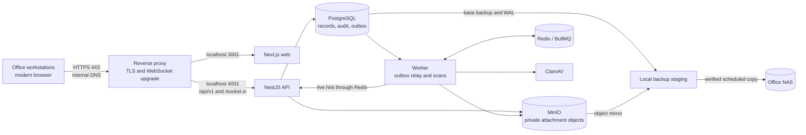

# On-premises deployment architecture assessment

_Assessment date: 2026-10-10. This is a deployment recommendation, not a change to the accepted [single-host deployment ADR](adr/0004-deployment-model.md) or a claim that the pilot server is ready._

## Recommendation

Run the existing production Docker Compose stack on one dedicated Linux server. If IT provides Windows Server, run the same Linux stack in one Linux VM. Put a reverse proxy on that host, expose only HTTPS to office workstations, keep the live database and object store on local resilient disks, and copy coordinated backups to the office NAS. This preserves the current application and recovery design without introducing a cluster.

The application runtime has no public-cloud integration in the inspected paths. Fully isolated operation still needs a controlled way to import container images, build dependencies, OS updates, and ClamAV signatures. No public-cloud service is unavoidable for the deployed application.

## 1. Facts verified from the repository

| Area | Current implementation | Evidence |
| --- | --- | --- |
| Application | An npm-workspaces monorepo has a Next.js web client, NestJS API, separate Node worker, and shared contracts. The browser calls the REST API and uses Socket.IO for live updates. | [README](../README.md), [runtime topology](architecture.md#3--runtime-topology), [browser API client](../apps/web/src/lib/api.ts), [realtime client](../apps/web/src/features/realtime/use-realtime-sync.ts) |
| Database and queue | PostgreSQL stores users, documents, workflow state, file metadata, notifications, audit records, and the transactional outbox. Redis stores BullMQ jobs and carries live notification messages; it is not the system of record. | [Compose](../docker-compose.yml), [worker](../apps/api/src/worker.ts), [Redis-loss runbook](runbooks/redis-loss.md) |
| Attachments | A private MinIO bucket holds bytes under server-generated keys. Uploads record a SHA-256 digest, accept a defined file-type allow-list, and have a compiled 25 MiB limit. Preview and download require authorization and a `CLEAN` scan result. | [storage adapter](../apps/api/src/modules/files/minio-storage.adapter.ts), [file policy](../apps/api/src/modules/files/media-types.ts), [attachment service](../apps/api/src/modules/files/attachments.service.ts) |
| Background work | The worker relays outbox events into BullMQ, scans uploads through ClamAV, and sends live notification hints. The notification inbox is stored in PostgreSQL. Report PDF/XLSX responses are currently rendered in the API request path, despite older architecture prose mentioning worker exports. | [worker](../apps/api/src/worker.ts), [queue](../apps/api/src/modules/jobs/outbox-queue.ts), [report controller](../apps/api/src/modules/reports/reports.controller.ts) |
| Deployment | The base Compose file publishes development ports. The [production overlay](../docker-compose.production.yml) removes host ports for PostgreSQL, Redis, MinIO, and ClamAV; binds API and web to loopback; and adds restart policies. A one-shot migrator gates API startup. No reverse-proxy configuration is supplied. | [base Compose](../docker-compose.yml), [production overlay](../docker-compose.production.yml), [deployment ADR](adr/0004-deployment-model.md) |
| Identity | Local password accounts use signed session cookies, CSRF protection, role capabilities, and organizational scope checks. Production bootstrap requires configured administrator and Director credentials. Directory SSO and MFA are deferred. | [authentication](../apps/api/src/modules/auth/auth.service.ts), [session service](../apps/api/src/modules/auth/session.service.ts), [authorization](../apps/api/src/modules/authorization/authorization.service.ts), [policy register](policy-register.md) |
| Health and logs | The API checks PostgreSQL and MinIO readiness; the worker checks PostgreSQL and Redis. Structured JSON logs include correlation IDs and redact credential-shaped and specified personal fields. Audit events live in PostgreSQL. | [API health](../apps/api/src/modules/health/health.controller.ts), [worker health](../apps/api/src/worker.ts), [logger](../apps/api/src/common/structured-logger.ts) |
| Recovery | Policy P-13 specifies an off-host recovery point of at most five minutes and a two-to-four-hour restore window. The runbooks combine PostgreSQL base backups and WAL with an object mirror on an office NAS. A NAS restore was rehearsed with pilot-sized data, but replacement-hardware preparation was not timed. | [policy register](policy-register.md), [backup runbook](runbooks/backup-restore.md), [NAS runbook](runbooks/nas-backup-target.md), [rehearsal](evidence/d3-restore-rehearsal.md) |
| Offline inputs | Web fonts are vendored. Runtime integrations found in the application point to local services. Docker builds still use upstream base images, `npm ci`, Go modules, and Alpine packages; the ClamAV image normally updates signatures. | [font note](../apps/web/app/fonts/README.md), [API Dockerfile](../apps/api/Dockerfile), [web Dockerfile](../apps/web/Dockerfile), [MinIO Dockerfile](../minio/Dockerfile.fromsource) |

## 2. Risks and limitations inferred from the implementation

1. **Starting the base Compose file alone exposes internal services.** Always supply the production overlay and inspect its rendered configuration. Check reachability from another LAN host, including on Docker Engine versions with different localhost-publishing behavior. The [README production procedure](../README.md#production-stack-docker) requires Engine 28 or later and Compose support for the overlay's `!reset` and `!override` tags. [Docker's port-publishing documentation](https://docs.docker.com/engine/network/port-publishing/) describes the older same-LAN localhost exposure.
2. **One health response does not represent the whole workflow.** API readiness excludes Redis; worker readiness excludes MinIO and ClamAV. A Redis or scanner outage can leave new versions `PENDING` while other functions work. Five exhausted scan attempts park a job, and loss of a Redis volume can lose already-published scan jobs. Follow the [scanner](runbooks/scanner-down.md) and [Redis](runbooks/redis-loss.md) recovery runbooks, and alert on pending-work age.
3. **Database and object recovery have different clocks.** The NAS rehearsal recovered some file-version rows for which newer attachment bytes had missed the last object mirror. Downloads then fail closed; affected files need reupload. The five-minute recovery point must be remeasured on the actual server, NAS, and document workload. See the [rehearsal](evidence/d3-restore-rehearsal.md) and [restore runbook](runbooks/backup-restore.md).
4. **Current runtime credentials are broad.** Compose gives the application the PostgreSQL initialization credentials and MinIO root credentials. API and worker also receive the Director bootstrap password because production startup validates it. The host configuration needs strict permissions now; separate runtime, migration, storage, and bootstrap identities before accepting a higher-security production environment. The [audit relocation runbook](runbooks/audit-relocation.md) also notes that its database trigger prevents accidents, not a privileged database administrator.
5. **NAS availability and backup freshness are operational dependencies.** The [freshness script](../scripts/check-backup-freshness.sh) reports stale copies, but a scheduler exit code is not an alert until a local notification path is connected and tested. The Linux SMB-in-container path is recorded as unexercised in the [NAS runbook](runbooks/nas-backup-target.md). A stalled WAL archive must trigger an alert before PostgreSQL's local WAL disk fills. Backup pruning and retention need an approved schedule.
6. **Offline builds and malware definitions need supply procedures.** The vendored MinIO source alone does not make its Go build or the other Docker builds offline. Prestage tested images and dependencies, and maintain current ClamAV database files through an approved internal mirror or controlled transfer. Track signature age and the date of the last successful update. See [ClamAV signature management](https://docs.clamav.net/manual/Usage/SignatureManagement.html) and [private mirror guidance](https://docs.clamav.net/appendix/CvdPrivateMirror.html).
7. **The single host has no automatic failover.** Restart policies recover exited containers after Docker starts; they do not replace host recovery, backup restoration, or an operator response to an unhealthy container. The existing [deployment ADR](adr/0004-deployment-model.md) explicitly makes restore-from-backup the availability plan.

## 3. Recommended target architecture

### Host and service placement

- Use one dedicated Linux LTS host with a UPS and mirrored local SSDs. Use Docker Engine 28 or later and a Compose release that supports the production overlay. Put PostgreSQL, Redis, MinIO, ClamAV, the one-shot migrator, API, worker, and web in the existing Compose project. Enable Docker at boot and rehearse an unattended reboot. Keep named volumes for live state on local storage; RAID or mirroring improves availability but is not a backup.
- Use a small, host-managed Nginx or Caddy reverse proxy for TLS. Send `/api/v1/*` and `/socket.io/*` to the API, preserving WebSocket upgrades; send remaining paths to Next.js. Keep web and API on one browser origin. Proxy access logs must follow the project's personal-data policy.
- Use a single Linux VM under an existing Windows Server/Hyper-V host if that is IT's supported platform. Reserve CPU, RAM, disk, boot order, and backup rights for the VM. Do not use Docker Desktop as an unattended Windows Server service; the [NAS runbook](runbooks/nas-backup-target.md#docker-on-windows-server) describes the supported choices.

### LAN, DNS, TLS, ports, and firewall

Reserve a server IP and create an internal DNS A record such as `dts.internal.<office-owned-domain>`. Issue a certificate through an office-controlled CA and deploy that CA trust to managed workstations. Provide internal DNS and time synchronization even when internet access is blocked; clock drift affects TLS, sessions, and audit timing. Keep certificates and CA recovery material in the operations plan.

| Direction | Allowed traffic | Purpose |
| --- | --- | --- |
| Authorized office VLANs → server | TCP 443; optionally TCP 80 only for redirect | User interface, API, WebSocket |
| IT management VLAN → server | SSH and approved management ports only | Host and VM administration |
| Server → office DNS/NTP | DNS and NTP ports as configured locally | Name resolution and time |
| Server → NAS | SMB TCP 445, if using the current NAS share | Backup copy and restore |
| Workstations → PostgreSQL, Redis, MinIO, ClamAV, API/web loopback ports | None | Internal services stay behind Compose and the proxy |

Check the effective Compose model with `docker compose -f docker-compose.yml -f docker-compose.production.yml config --quiet`, then verify published ports without dumping credentials into logs. Probe from another LAN host: only the intended HTTPS service should answer. The proxy must replace untrusted client forwarding headers. Set `TRUST_PROXY=1` only for exactly one trusted proxy hop, or configure its address explicitly.

For the proposed hostname, configure `NODE_ENV=production`, `WEB_ORIGIN=https://dts.internal.<office-owned-domain>`, `PUBLIC_API_URL=https://dts.internal.<office-owned-domain>/api/v1`, `COOKIE_SECURE=true`, `COOKIE_SAME_SITE=lax`, and `API_DOCS=false`. Supply unique database, MinIO, session, administrator, and Director secrets. `PUBLIC_API_URL` is compiled into the web bundle, so a hostname change requires a web rebuild. See [.env.example](../.env.example), [environment validation](../apps/api/src/config/environment.ts), and the [web Dockerfile](../apps/web/Dockerfile).

### Identity, authorization, and secrets

Use the existing local accounts, administrator-approved account requests, per-user roles, and server-side document scope checks for the first deployment. The LAN boundary does not replace these controls. Provision the administrator and Director with unique credentials; review existing databases for development users. Apply a workstation lock policy for shared desks. Directory SSO or MFA is a separate project because the repository does not implement it today.

Keep the deployment environment file readable only by the service administration account, restrict Docker access to a small IT group, protect backup credentials separately, and keep recovery keys outside the application host. Before production hardening sign-off, provision separate PostgreSQL runtime and migration roles plus a non-root MinIO application identity. Change the bootstrap flow so the Director's password need not remain in API and worker environments after account creation. These require implementation work; this assessment does not make those changes.

### Shared storage, data integrity, and capacity

Keep live MinIO and PostgreSQL data on local SSD volumes; staff should not mount the NAS or MinIO bucket directly. Every read stays behind the API's authorization and scan checks. Protect the NAS archive with a dedicated backup identity and no ordinary-user share access. Validate a restored sample of objects against the SHA-256 values recorded in PostgreSQL, and add a periodic integrity sample or full scrub as volume grows. A checksum is stored on upload, but the current download path does not rehash every object.

Estimate live object bytes as **document count × retained versions per document × average attachment size**, then add database, object-store metadata, free-space headroom, and restore working space. For illustration, 100,000 documents × two 5 MiB versions is about 0.95 TiB of attachment bytes before overhead. Document policy is soft delete only, so capacity grows until a separately approved lifecycle policy changes it. The NAS needs additional space for object copies, retained base backups and WAL, and a protected second copy. A busy PostgreSQL instance with `archive_timeout=60` may archive roughly one 16 MiB segment per minute of activity—about 22.5 GiB per busy day before documents and bases—so measure real WAL output before setting retention.

### Backup, restore, and disaster recovery

Keep the existing continuous WAL, nightly base-backup, and three-minute object-mirror pattern. Define backup retention and pruning with IT and Records: retain the complete WAL sequence needed by the oldest retained base. Verify the NAS copy rather than only the local archive. Prefer local backup staging plus a checked, frequent NAS push on Linux as well as Windows; this adapts the [rehearsed Windows pattern](evidence/d3-restore-rehearsal.md) and avoids binding PostgreSQL archiving directly to an untested SMB mount. It requires a Linux push job and updated freshness checks before use. The existing direct-mounted Linux procedure remains a viable pilot option only after it passes mount-loss, permissions, and restore drills on the target host.

Maintain one encrypted, disconnected or immutable on-premises recovery copy in addition to the online NAS archive. Restrict deletion rights and rehearse restoration from that copy. [CISA recommends offline encrypted backups and regular restore tests](https://www.cisa.gov/stopransomware/ransomware-guide). Restore to a replacement stack from a copy of the NAS archive, not the archive itself. Restore PostgreSQL first, then objects; check counts, sample digests, audit access, and stranded `PENDING` scans. The five-minute recovery point may still leave rows for attachments uploaded since the last mirror; identify those files and arrange reupload. A second audit database, when introduced for five-year relocation, needs its own backup and restore procedure.

### Logs, health, alerting, and failure behavior

Start with a local IT collector or monitoring host, rather than a large observability stack. Retain structured application logs with restricted access and an approved log-retention period; preserve PostgreSQL audit events according to [P-08](policy-register.md). Alert through an internal mail relay or an attended IT console, not a public webhook. Test delivery to the on-call person.

Check HTTPS/TLS expiry, API and worker readiness, Compose health, PostgreSQL archiver failures and `pg_wal` free space, Redis queue depth and oldest failed job, age of `PENDING` scans, MinIO reachability, ClamAV signature age, NAS mount/marker and backup freshness, disk usage, and UPS state. Set operational warning thresholds before disk or retention limits become urgent. The API may remain ready during Redis loss, so the worker and queue need independent checks.

At boot, Docker's restart policies restart exited services, while Compose's migration gate applies on a fresh `up`. Rehearse the whole boot sequence: Docker daemon, backup mount or staging availability, PostgreSQL, Redis, MinIO, ClamAV, migrator, API, worker, proxy, and a real upload. During a LAN interruption, an in-flight browser write may have committed even if its response was lost; users should reload the record before retrying. During Redis or ClamAV failure, preserve pending work, restore the service, and use the documented requeue procedures. During NAS failure, alert and protect local WAL/staging capacity; the off-host recovery point cannot be promised while copies are failing.

### Offline operation and workstations

Build versioned, tested images in a connected staging environment, or supply a local artifact mirror. Transfer images, npm/Go/package-manager dependencies, OS security updates, and ClamAV definitions through the approved isolation boundary. Keep a manifest with image digests, signature dates, source revision, and rollback images. Run a full acceptance pass with public internet disconnected. A private ClamAV update mirror or controlled signature import is required to keep scanning useful; stale signatures are an operational risk even if the daemon remains healthy.

Office users need managed, updated browsers with JavaScript, cookies, PDF viewing, downloads, and WebSockets to the internal hostname. The current [end-to-end configuration](../apps/e2e/playwright.config.ts) exercises Desktop Chrome/Chromium; certify the office's chosen Edge or Chrome version and any other browser separately. No workstation application install is required. Accepted uploads are PDF, PNG, JPEG, WebP, DOCX, and XLSX up to 25 MiB; browser preview is limited to PDF and images.

## 4. Alternatives and tradeoffs

| Option | Appropriate when | Tradeoff |
| --- | --- | --- |
| **Recommended: Compose on a dedicated Linux host** | IT can support Linux and the office accepts restore-based availability | Fewest layers; the host remains one failure domain. |
| **Compose in one Linux VM on Windows Server** | Existing hardware and Hyper-V operations are standard | Preserves Linux containers but adds hypervisor, VM storage, time, and boot-order checks. |
| **Split PostgreSQL and object storage onto dedicated hosts later** | Measured load, storage growth, or recovery needs exceed one host | Better resource isolation, but more network dependencies, backup coordination, and operational work. It is not automatic high availability. |

Direct host installation would require separate service managers, patch paths, and version control for every dependency. Kubernetes is disproportionate for the currently accepted single-host, restore-based model. Neither is recommended for the initial office deployment.

## Phased implementation and migration plan

1. **Confirm targets.** IT and Records establish actual concurrent users, document ingest and average size, server/VM inventory, NAS capacity, allowable network paths, uptime needs, update-transfer method, and backup/log retention. Reconcile these with P-13 before procurement.
2. **Prepare staging.** Build and pin images; transfer them if isolated. Configure internal DNS, CA trust, reverse proxy, firewall, time source, UPS, storage, secrets, and backup destination. Review the rendered production Compose model without printing secrets.
3. **Harden and rehearse.** Make the credential separation and alert-path changes. Test empty and representative database migrations, production seeding, role/scope behavior, browser workflows, realistic load, unattended reboot, service interruptions, NAS loss, and restore from NAS and protected copy.
4. **Migrate and cut over.** If real data already exists, freeze writes and capture a coordinated PostgreSQL/WAL and MinIO recovery set. Restore to the target, verify row counts and representative object checksums, apply reviewed migrations once, then switch internal DNS. For a new database, seed production accounts once with unique credentials. Keep the former system isolated and read only through the rollback window.
5. **Operate and upgrade.** Schedule maintenance; take and verify a fresh recovery set; test migrations against a restored representative database; import pinned replacement images; deploy; then run smoke and integrity checks. Keep prior images and release manifests. An older application may not run against a newer schema, so rollback can require restoring the database and objects together. Never run destructive integration tests against the office database.

## Starting hardware estimates

These are planning estimates, not guaranteed capacity. The repository's [D2 load exercise](evidence/d2-load-test.md) used 60,000 seeded documents and a six-core desktop. After its documented changes, read p95 was 126 ms at 15 actions/s and 166 ms at 30 actions/s; pilot hardware and real documents still need their own measurements. ClamAV alone is estimated at roughly 2 GiB of RAM in the [deployment ADR](adr/0004-deployment-model.md).

| Office load | Initial compute | Live storage starting point |
| --- | --- | --- |
| Small: up to about 25 active users | 4–8 cores, 16–32 GiB RAM | Mirrored SSDs; 0.5–1 TiB usable, adjusted for actual attachment volume |
| Medium: about 25–75 active users | 8–12 cores, 32–64 GiB RAM | 1–4 TiB usable; reserve separate database/WAL and object capacity |
| Larger: about 75–200 active users | 16–24 cores, 64–128 GiB RAM; evaluate a dedicated database host | Size from measured ingest, retained versions, WAL, and recovery time |

Size the NAS and protected second copy separately. Measure sustained actions/s, concurrent scans, document mix, and export size before committing to the larger tier.

## Deployment validation checklist

- [ ] **Functionality:** From an office workstation, sign in as each pilot role; register, route, search, upload, scan, preview/download, release, export PDF/XLSX, and verify durable notifications after WebSocket reconnect.
- [ ] **Security:** Verify TLS trust, HTTPS-only session cookies, CSRF and role/scope denials, no demo credentials, least-privilege service accounts, secret-file permissions, and audit entries. Probe from another VLAN; only approved ports should answer.
- [ ] **Backup:** Force WAL rotation and confirm the segment reaches the NAS. Check mirror, base, and freshness markers. Stop one backup job and verify an alert reaches a person. Check storage headroom and the pruning rule.
- [ ] **Restore:** Restore to a separate replacement host from the NAS and protected copy. Compare document counts, audit records, sample file digests, pending scans, and actual recovery point/time. Never use the live NAS archive as the restore target.
- [ ] **Performance:** Run the repository's load mix with real concurrency, attachment sizes, and exports on target hardware; record p95 latency, PostgreSQL CPU, queue age, memory, and NAS copy duration.
- [ ] **Failure recovery:** Reboot unattended; interrupt LAN, Redis, ClamAV, MinIO, and NAS access separately; verify alerts, user-visible behavior, service recovery, requeue steps, and safe PostgreSQL WAL space.
- [ ] **Isolation:** Disconnect public internet during a full workflow test. Verify local DNS, certificate validation, fonts/assets, image restart, scanner operation, and the approved update-transfer process.

## Assumptions and decisions still needed

| Assumption used here | If the answer differs |
| --- | --- |
| One office site and an available NAS; the repository's 158-account pilot estimate is a useful planning reference, not a confirmed user count. | Higher concurrent use or ingest changes hardware and may justify a dedicated database host. No NAS requires a different off-host backup target before cutover. |
| P-13's recovery point of at most five minutes and two-to-four-hour restore window remain acceptable. | A near-zero outage requirement needs a second application/database site and a failover design; a single host cannot provide it. |
| IT can operate Linux directly or as one VM, manage internal DNS/CA/NTP, and reserve a static address. | The host choice, certificate rollout, and workstation trust plan must change. |
| Public internet is unavailable to the running application; controlled offline imports are permitted for updates. | With no permitted import path, image patches and malware signatures cannot be kept current. If controlled internet is allowed, restrict it to an update proxy or mirror, not general application egress. |
| Actual document volume, average retained versions, backup retention, available disk, and uptime target are not established by repository code. | Measure them and revise the capacity, NAS retention, monitoring thresholds, and recovery rehearsal before procurement. |

## Assessment validation

The source files and runbooks above were inspected without changing application code. On the assessment workstation, `docker compose version` reported v5.5.1 and `docker compose -f docker-compose.yml -f docker-compose.production.yml config --quiet` passed. No service was started, LAN exposure was not probed, and a new restore or load test was not run for this assessment. Repository evidence from prior drills is identified as such; it is not a substitute for testing on the office host.
