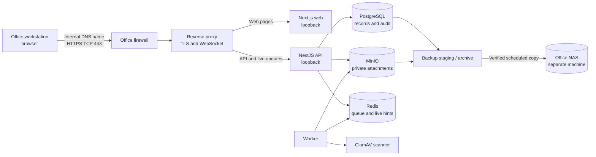

# Beginner's guide to setting up DMTS on-premises

This guide turns the [on-premises deployment assessment](on-premises-deployment-assessment.md) into a practical sequence for a first deployment. It assumes little or no experience with servers or networking. It explains the work; it does not mean that the office server has been installed, tested, or approved for production.

## Before you begin

### What you are setting up

DMTS is a web application for office users. The recommended setup runs the application and its supporting services on one dedicated Linux server. Users open a browser on the office network and visit one internal web address. A reverse proxy receives that browser connection, secures it with HTTPS, and directs each request to the correct part of the application.

The application uses PostgreSQL for records and workflow data, MinIO for attachment bytes, Redis for background job queues and live-message delivery, and ClamAV to scan uploaded files for malware. A separate worker performs background tasks such as scanning. Backups are copied to the office NAS, which is a separate network storage device.

### Who should do the work

- **IT/network administrator:** server or VM, network address, DNS, certificates, firewall, operating system, Docker, monitoring, NAS access, and recovery arrangements.
- **DMTS/application administrator:** repository release, application configuration, initial accounts, migrations, application checks, and upgrades.
- **Records or business owner:** document volume and retention needs, user roles, acceptance of recovery targets, and confirmation that work processes behave correctly.
- **Security or privacy owner:** approval of access, secrets, logs, backup protection, update-transfer process, and any required security controls.

One person may have more than one role, but make it clear who owns each decision and operational task.

### Stop before production if

Do not call the system production-ready until the office has resolved the decisions in [Decisions to resolve before cutover](#decisions-to-resolve-before-cutover), completed the security work, tested alerts, and rehearsed a restore on the target environment. The assessment verified repository configuration and earlier pilot evidence; it did not install the system on the office server or test the office LAN.

## The network in plain language

Think of the office network as a private road system. A workstation is a user's computer. The server has a reserved address on that network. Internal DNS is the office address book: it maps a readable name such as `<dts-hostname>.<office-domain>` to the server's address. The firewall is a set of gates that permits only approved kinds of traffic. HTTPS is the protected connection between the browser and the server.

The reverse proxy is the reception desk on the server. It accepts the browser's HTTPS connection and passes ordinary page requests to the web application, while sending `/api/v1` and `/socket.io` requests to the API. WebSocket is a connection that stays open so the application can deliver live updates. The proxy must support WebSocket upgrades. The web application and API should share one browser origin (the same scheme, hostname, and port) so browser security and session behavior work as configured.

Inside the server, Docker runs the application services as containers. Containers are isolated, packaged processes that can communicate over a private Compose network. Office workstations should not connect directly to PostgreSQL, Redis, MinIO, or ClamAV. Only the proxy-facing application ports should be reachable from the proxy on the host.

## Phase 1 — Make the deployment decisions

**Purpose:** Choose the target and agree on the operational needs before purchasing equipment or configuring a network.

**Owners:** IT, Records/business owner, application administrator, and security/privacy owner.

**Have ready:** Expected users, document counts and sizes, existing server and NAS details, office network/VLAN rules, update restrictions, and recovery expectations.

### Actions

1. Choose the primary host model:
   - **Recommended:** one dedicated Linux LTS server.
   - **Windows Server environment:** one Linux virtual machine (VM) hosted on the existing Windows Server with Hyper-V. A VM is a separate computer implemented in software; Linux runs inside it and runs the Linux containers.
2. Name the people responsible for patching, monitoring, responding to alerts, account administration, backup checks, and restore decisions.
3. Confirm how many people will use DMTS concurrently, how many documents and retained versions are expected, average attachment sizes, and expected growth. The assessment's hardware figures are starting estimates, not guarantees.
4. Ask Records and IT to confirm backup retention and pruning. The repository's P-13 target is a recovery point of at most five minutes and a restore window of two to four hours. Confirm these targets are acceptable and measurable for the real server and workload.
5. Confirm that an office NAS exists, has enough capacity, supports SMB 3, and can hold the database archive and attachment mirror. Agree on a protected second recovery copy and who can delete backup files.
6. Decide whether the application server can access the public internet. Even when user traffic stays entirely inside the office, operators still need an approved method to import tested container images, software dependencies, operating-system updates, and ClamAV virus definitions.
7. Write down decisions, owners, and due dates. Do not guess the office hostname, IP address, VLANs, retention schedule, or allowed ports.

**Check:** Each decision has an owner and an agreed value or a clear blocker. Hardware capacity and recovery targets are based on measured or approved needs, not just the examples in the assessment.

**Common problems and recovery:** If user counts or storage needs are unknown, gather a representative sample and estimate retained versions and sizes before sizing disks. If the NAS or update-transfer path is unavailable, pause the production plan and get an approved alternative; neither should be silently omitted.

## Phase 2 — Prepare the server, network, and office name

**Purpose:** Give the application a stable, supportable home and allow authorized office computers to reach it securely.

**Owners:** IT/network administrator; security owner approves access policy.

**Have ready:** Approved host model, asset details, a reserved IP address, hostname, internal DNS administration, office certificate authority contact, firewall change process, UPS/power plan, and storage plan.

### Actions

1. Provision a dedicated Linux LTS server with a UPS (battery backup) and mirrored local SSDs as recommended. Mirroring can keep the server running through one disk failure; it is not a backup. If using Windows Server, provision a Linux VM and reserve its CPU, memory, disks, boot order, and backup responsibilities.
2. Install and patch the supported Linux operating system. Configure administrator access under IT policy, time synchronization, and host monitoring. Keep system time accurate; certificates, sessions, and audit timestamps depend on it.
3. Reserve a stable server IP address. An IP address is the numeric network location of a device. Ask IT to reserve it through the office's approved network process rather than picking an address yourself.
4. Ask the DNS administrator to create an internal DNS A record such as `<dts-hostname>.<office-owned-domain>` pointing to that reserved address. An A record is the address-book entry mapping a name to an IPv4 address. Use the actual office-owned name, not this placeholder.
5. Ask the office certificate authority to issue a TLS certificate for that exact hostname. TLS is the encryption protocol used by HTTPS. Arrange for the office's trusted certificate authority (CA) certificate to be installed on managed workstations. Store certificate renewal and recovery instructions with IT.
6. Ask IT to configure firewall rules. A firewall filters network connections. Allow only approved office workstation networks to reach TCP 443 on the server. Allow only the IT management network to use approved administration access, such as SSH. Permit only the server's required DNS/NTP access and its approved route to the NAS on SMB TCP 445. Do not expose database, queue, object-store, scanner, or loopback application ports to workstations.
7. Decide who manages the reverse proxy (for example, host-managed Nginx or Caddy). It needs the TLS certificate, must route normal paths to the web service, route `/api/v1` and `/socket.io` to the API, and preserve WebSocket upgrades. Restrict its logs according to the personal-data policy.

**Check:** From a managed office workstation, the chosen hostname resolves to the approved server address and the workstation trusts the issued certificate. Verify these only after IT has made the changes. Confirm the firewall change is documented.

**Common problems and recovery:** If the name does not resolve, ask the DNS owner to check the record and workstation DNS settings. If the browser warns about the certificate, check the hostname on the certificate, its validity, and whether the office CA is trusted; do not train users to bypass the warning. If connections fail, ask IT to trace the firewall path rather than opening broad access.

## Phase 3 — Install Docker and prepare the DMTS release

**Purpose:** Install the runtime that starts and manages the application containers and prepare production configuration.

**Owners:** IT installs and secures the host runtime; application administrator prepares the release and configuration.

**Have ready:** Repository release/revision approved for deployment, access to the host, approved image/build update route, hostname, certificate, and a secure way to generate and store secrets.

### Actions

1. Install Docker Engine 28 or later and Docker Compose v2.24.4 or later on the Linux host or Linux VM. These minimum versions matter because the production Compose overlay uses tags that replace the development port settings; Engine 28 is also required for the documented loopback port behavior.
2. Enable Docker at system startup so containers return after an unattended reboot. On Linux, the repository documents `systemctl enable docker`. Do not use Docker Desktop as an unattended Windows Server service; the repository's Windows Server options are a Linux VM or WSL 2 with Docker Engine installed in the Linux environment. This guide uses the Linux VM route for Windows Server.
3. Check out the approved repository revision on the server using LF line endings (Unix-style line endings). The repository notes that a CRLF copy of `infra/clamav/clamd.conf` can prevent ClamAV from starting. Preserve the approved revision identifier for the release record.
4. If the host is isolated from the internet, prepare a controlled transfer from a connected staging environment. Transfer tested container images and required npm, Go, and operating-system dependencies, plus ClamAV definitions. Keep a manifest of source revision, image digests, signature dates, and rollback images. Test the import process before relying on it.
5. From the repository root, create the environment file from `.env.example` using a secure method. The environment file holds deployment settings and secrets. Restrict it so only the service administration account can read it; never commit it, paste secrets into chat/tickets, or include it in support logs.
6. Set the production values required by the repository, including `NODE_ENV=production`, `COOKIE_SECURE=true`, `COOKIE_SAME_SITE=lax`, the approved `WEB_ORIGIN`, `PUBLIC_API_URL`, and the correct `TRUST_PROXY` setting. Set `API_DOCS=false` unless an approved reason says otherwise. Use the actual HTTPS hostname. `PUBLIC_API_URL` is compiled into the web bundle, so changing it later requires rebuilding the web service.
7. Generate unique strong values for the session secret, PostgreSQL password, MinIO credentials, first administrator password, and Director password. The assessment also says API and worker currently receive the Director bootstrap password; that is one of the hardening items to resolve before production sign-off. Do not reuse example or development credentials.
8. Choose a backup path that lands on storage separate from the application host. Configure `BACKUP_PATH` according to the chosen host path in Phase 5. Never leave a production archive only on the server's own disks.

**Illustrative secret generation only:** On a Linux administration terminal, `openssl rand -base64 48` prints a random value suitable for a session secret. Generate each secret separately and enter it directly into the approved secret store or protected environment file. Do not put secrets into command history.

**Check:** Review the environment file privately against `.env.example` and the production configuration table in the README. Confirm placeholders are replaced, values are unique, the host name matches the certificate, and file permissions restrict access. Do not print the file to a terminal transcript.

**Common problems and recovery:** If the web app calls the wrong API hostname after a change, rebuild the web image because `PUBLIC_API_URL` is compiled into it. If ClamAV fails to parse its configuration, check that the checkout uses LF line endings. If any secret was disclosed, replace it and follow the organization's incident process.

## Phase 4 — Start and seed the application

**Purpose:** Start the data services and applications in the correct order, apply database migrations, and create initial production accounts.

**Owners:** Application administrator, with IT support.

**Have ready:** Production configuration reviewed, Docker running, approved images/dependencies available, and backup location prepared.

### Actions

Run these commands from the repository root on the Linux host or inside the Linux VM. They are based on the repository README; use the production overlay on every Compose command.

1. First inspect the merged configuration without displaying the environment file:

   ```bash
   docker compose -f docker-compose.yml -f docker-compose.production.yml config --quiet
   ```

   `--quiet` validates the configuration without printing the rendered settings. If it reports an error, fix the named configuration issue before continuing.

2. Start the stack:

   ```bash
   docker compose -f docker-compose.yml -f docker-compose.production.yml up -d --build
   ```

   This starts PostgreSQL, Redis, MinIO, ClamAV, the one-time migration service, API, worker, and web. Initial builds may take several minutes. API startup waits for dependencies to become healthy and migrations to finish.

3. Check service status:

   ```bash
   docker compose -f docker-compose.yml -f docker-compose.production.yml ps
   ```

   Wait for services to become healthy. ClamAV can take a few minutes to load definitions. If a service is unhealthy, inspect only that service's recent logs, for example `docker compose ... logs --tail 50 clamav`; check logs for secrets before sharing them.

4. Seed the production organization and first accounts exactly once using the repository command:

   ```bash
   docker compose -f docker-compose.yml -f docker-compose.production.yml run --rm --no-deps migrate node dist/database/seed.js
   ```

   This uses the production administrator and Director credentials configured in the environment. Production seeding does not create the development staff accounts. Check for and deactivate any development accounts if this database was previously used for development.

**Check:** All long-running services show healthy; the one-shot migrator completed successfully; the production seed completed; the application is reachable only from the server itself on the loopback application ports before the proxy is enabled.

**Common problems and recovery:** If API does not start, inspect migration and dependency health before retrying. Do not manually skip migrations. If ClamAV is still starting, allow it time to load, then inspect its logs. If the seed fails, correct the production account configuration and use the documented seed process; do not create shared default accounts.

## Phase 5 — Connect the NAS and verify backups

**Purpose:** Keep recoverable database and attachment copies on a different machine, then prove that the backup process is running and can alert someone.

**Owners:** IT storage administrator and application administrator; Records/security approve retention and access.

**Have ready:** Dedicated NAS account, approved NAS folder/share, network route, retention/pruning decision, enough capacity, protected second copy, and named alert recipient.

PostgreSQL's write-ahead log (WAL) records database changes so a base backup can be advanced to a recent point in time. The object mirror copies attachment bytes from MinIO. Both are needed: a database row without its attachment is incomplete, and attachment bytes without the database record are not a usable DMTS file.

### Actions common to both host choices

1. On the NAS, create the archive folder and its `.dts-archive` marker file. Create a dedicated backup account with read/write rights only to that archive. Give ordinary users no write/delete permission. Keep SMB 1 disabled; use SMB 3.
2. Calculate NAS capacity from attachment volume, base backups, retained WAL, and a second protected copy. Agree on retention and pruning with Records and IT. Never delete WAL needed by the oldest base backup that must remain restorable.
3. Configure the backup freshness check to alert a real person or attended IT console. A failed scheduled-task or cron exit code alone is not an alert.
4. Keep one encrypted, disconnected or immutable recovery copy in addition to the online NAS archive. Restrict who can delete it and include it in restore exercises.

### Linux host or Linux VM

The runbook describes mounting the NAS share on Linux and points `BACKUP_PATH` to that mount. The credentials file must be root-readable only. Follow the detailed steps in [NAS backup target runbook](runbooks/nas-backup-target.md#3b-linux-pilot-server-or-a-linux-vm). Important checks include:

```bash
findmnt -t cifs /mnt/dts-backup
test -f /mnt/dts-backup/.dts-archive && echo ok
```

The first command must show the NAS mount; the second confirms the marker is visible. Configure Docker to wait for the mount before starting. If the share is absent, the local mount directory can look like a valid empty folder and silently receive data on the server instead. The repository explicitly says that Postgres archiving and the object mirror writing to a CIFS mount from inside a container have not yet been exercised. Treat this path as unverified until it passes on the target host, including mount-loss and restore drills.

### Windows Server with Linux VM

Run the Linux host procedure inside the Linux VM. The VM mounts the NAS itself; the Windows host's mapped drive is not the same as a mount visible inside the Linux VM. The NAS runbook describes another Windows-host staging-and-copy option, but this guide's recommended Windows deployment keeps Linux services in a Linux VM. Do not point a Linux container at a Windows mapped drive and assume that proves the NAS received the backup.

### Checks and recovery

1. Confirm `wal/`, `base/`, and `objects/` are visible by browsing the NAS from another machine.
2. Force a PostgreSQL WAL switch following the runbook and confirm the resulting segment reaches the NAS promptly.
3. Check the backup freshness script and ensure it reports no stale items. Stop or block a backup job in a controlled test and confirm an alert reaches the named person.
4. Restore to a separate replacement/test stack from a copy of the NAS archive. Restore the database first and objects second. Compare record counts, audit data, sample attachment SHA-256 digests, stranded pending scans, recovery point, and elapsed restore time.
5. Never restore directly into the NAS archive. Copy the archive to a separate restore location first; a restored database can write its new timeline into the backup path.

**Common problems and recovery:** A fresh local archive with stale NAS markers means copies are not reaching the NAS. Stop treating the recovery point as met, alert IT, protect local disk space, fix the transfer, and perform a restore check. If a restore has records whose attachment bytes were not mirrored, those downloads fail closed and the affected files need reupload. Do not claim a successful backup merely because a script exited successfully; verify the remote files and rehearse restoration.

## Phase 6 — Put HTTPS in front and restrict network access

**Purpose:** Provide a single secure browser address while keeping internal services private.

**Owners:** IT/network administrator and application administrator.

**Have ready:** Working proxy, valid certificate, internal DNS entry, approved firewall rules, and production Compose services.

### Actions

1. Configure the proxy on the same host to send the root web pages to the web service (default host port 3001), and `/api/v1` and `/socket.io` to the API (default host port 4001). Preserve WebSocket upgrades for live updates.
2. Configure HTTPS using the office certificate. Redirect HTTP to HTTPS if port 80 is enabled; port 80 is optional and should be allowed only if IT approves it for redirection.
3. Configure the API's `TRUST_PROXY` to trust exactly one proxy hop (`1`) or the proxy's explicit address/CIDR, as appropriate. Do not set it to `true`. This tells the API which proxy may provide the original client address; trusting arbitrary browser-supplied forwarding headers weakens this boundary.
4. Ask IT to confirm the host firewall allows TCP 443 from approved workstation networks, plus explicitly approved management access. Do not expose PostgreSQL, Redis, MinIO, ClamAV, or the API/web loopback ports to office clients.
5. Validate the rendered Compose configuration privately. The repository recommends checking that only API and web have published ports and both are bound to `127.0.0.1`. The README's illustrative development ports are 5433, 6380, 9002, 9003, 3311, 3001, and 4001; actual configured values may differ. Never print secrets while inspecting configuration.
6. From a separate machine on an authorized LAN, verify that the HTTPS site works and that direct connections to internal service ports fail. Also test from an unauthorized VLAN or network where available, in coordination with IT.

**Check:** Browser displays the correct hostname with a trusted certificate; sign-in and API calls work; live updates reconnect; only approved ports answer from the relevant networks.

**Common problems and recovery:** If pages load but API calls fail, check hostname, `PUBLIC_API_URL`, proxy path routing, and rebuild web if the compiled URL changed. If live updates fail, check the proxy's WebSocket handling. If the API sees every user as the proxy, correct `TRUST_PROXY` to the actual trusted hop. Never solve routing problems by publishing internal service ports broadly.

## Phase 7 — Test the complete office workflow and failure recovery

**Purpose:** Confirm the installation behaves safely for each user role and can recover from likely service failures.

**Owners:** Application administrator, IT, pilot users, Records/business owner, and security owner.

**Have ready:** Pilot user accounts, approved test data, a safe test environment or explicit approval to use pilot data, backup checks, and monitoring/alert access.

### Actions

1. From a managed office workstation, test sign-in for each pilot role, registration, routing, search, attachment upload, scan completion, preview/download, release, PDF/XLSX export, and durable notifications after reconnecting the browser.
2. Confirm that PDF and image previews work. The accepted upload types are PDF, PNG, JPEG, WebP, DOCX, and XLSX up to 25 MiB; preview is limited to PDF and images.
3. Confirm unauthorized users cannot cross role or document-scope boundaries. Verify session cookies use HTTPS and CSRF protections and that no development/demo account remains enabled.
4. Confirm monitoring checks API and worker separately. API readiness does not prove Redis and scanner workflows work; worker health does not prove MinIO works. Monitor pending scan age, queue failures, NAS freshness, PostgreSQL WAL/disk use, ClamAV signature age, MinIO availability, TLS expiry, host disk, and UPS state.
5. Test reboot recovery without an operator signing in. Docker should start at boot; after reboot, confirm services are healthy, proxy works, and a new upload can be scanned. Confirm a NAS mount is present before Docker starts when the Linux mount approach is used.
6. In a controlled window, test interruptions to LAN, Redis, ClamAV, MinIO, and NAS access separately. Confirm user-facing behavior, alerts, safe recovery, and documented requeue steps. A Redis loss can strand uploads in `PENDING`; follow the [Redis loss runbook](runbooks/redis-loss.md). For scanner failures, follow the [scanner down runbook](runbooks/scanner-down.md).
7. Run a realistic performance test on the actual target hardware with representative concurrency, attachments, and exports. Record response p95, CPU, memory, queue age, and NAS copy duration. The assessment's previous load test is evidence about its test environment, not a guarantee for this server.
8. If the office intends isolated operation, disconnect public internet in a planned test and verify internal DNS, certificate trust, fonts/assets, container restart, scanning, and the approved update/signature import procedure.

**Check:** Complete the [deployment validation checklist](on-premises-deployment-assessment.md#deployment-validation-checklist), record results and failures, and obtain sign-off from each owner. Include timestamp, release revision, test operator, and follow-up actions.

**Common problems and recovery:** If files remain pending, check worker health, Redis, ClamAV health/signature age, then use the runbook requeue process. If only some restored files fail, compare database records and object mirror timing and arrange reupload. If any security or backup test fails, resolve and rerun it before cutover.

## Phase 8 — Cut over and operate the service

**Purpose:** Move users onto the verified deployment and keep it secure and recoverable.

**Owners:** IT service owner, application administrator, Records/business owner.

**Have ready:** Completed acceptance and security sign-off, fresh verified backups, user communication, support contact, rollback decision, and maintenance schedule.

### Cutover actions

1. If migrating existing records, freeze writes to the old system and take a coordinated PostgreSQL/WAL and MinIO recovery set. Restore on the target, verify counts and representative object checksums, and apply reviewed migrations once.
2. For a new deployment, seed production accounts once with unique credentials and distribute initial access through the organization's secure process.
3. Change internal DNS to the approved target if needed. Keep the prior system isolated and read-only for the agreed rollback period.
4. Tell users where to access DMTS, how to request accounts, what file types and size limits apply, and how to report problems.
5. Record the deployed revision, configuration owner, backup location, alert recipient, maintenance window, and incident/restore contacts.

### Ongoing operations

- Apply operating-system, Docker, application, dependency, and ClamAV updates through the approved process. For isolated hosts, track import manifests and signature freshness.
- Before every application upgrade, take and verify a fresh recovery set. Test migrations against a restored representative copy, import pinned replacement images, deploy, and run smoke/integrity checks. Keep prior images and release manifests.
- Do not assume application rollback alone is safe after a schema migration; rollback may require restoring the database and objects together.
- Review disk and NAS capacity, PostgreSQL WAL/archive status, backup freshness, scan queue age, failed jobs, ClamAV signature age, TLS expiry, and alert delivery on a defined schedule.
- Rehearse restoration from both the online NAS and protected second copy. Time the exercise against the approved two-to-four-hour restore window and record the measured recovery point.
- Set and review backup/log retention with Records and IT. Never prune WAL needed by retained base backups.
- Keep local accounts and role assignments current. Directory SSO and MFA are not implemented in the inspected deployment; treat them as separate future work if required by policy.

**Common problems and recovery:** If a release fails, follow the rollback plan for that release and account for schema/data compatibility. If NAS copying stops, alert the service owner and protect local WAL space immediately. If the host fails, restore to replacement hardware from a copy of the archive and follow the backup/restore runbooks.

## Windows Server option: Linux VM

Use this when the office standard is Windows Server but the DMTS container stack must remain Linux-based.

1. IT provisions a Linux VM under Hyper-V and reserves CPU, RAM, storage, a stable network address, and automatic boot. Include it in host, VM, and recovery monitoring.
2. Install and patch a supported Linux distribution inside the VM. Install Docker Engine 28+ and Compose v2.24.4+ inside Linux. Enable Docker at VM boot.
3. Follow Phases 3 and 4 from inside the VM. The Linux VM—not Windows PowerShell—is where Compose commands run.
4. Choose and test the NAS arrangement. The Linux VM can mount the SMB share and use the Linux runbook, but container CIFS writes remain an unexercised path in the assessment until tested. Ensure the VM's Docker service waits for the mount. Do not assume a Windows mapped drive is visible inside Linux containers.
5. Configure DNS, TLS, firewall, and proxy routing to the VM's approved address. Decide whether the proxy runs inside the VM or is host-managed, then configure and test the exact network hop.
6. Rehearse an unattended Windows host reboot, VM auto-start, Docker start, NAS availability, stack health, proxy, and a real upload. Verify restore from the NAS before cutover.

## Simple network diagram



The browser uses one office name and one encrypted HTTPS connection. The firewall lets that connection reach the proxy. The proxy routes it to the web service or API. The API talks to the private database and object store. The worker reads queued jobs, sends attachments through the scanner, and updates task status. Database recovery files and copied attachment bytes go to backup storage on a separate machine. Redis helps services coordinate work but is not the permanent record store.

## IT administrator checklist

- [ ] Host model, capacity, patch owner, and reboot plan are approved.
- [ ] Stable IP, internal DNS, time source, TLS certificate/CA trust, and renewal owner are configured.
- [ ] Firewall permits only approved user HTTPS, management, DNS/NTP, and NAS traffic.
- [ ] Docker Engine 28+ and Compose 2.24.4+ are installed; Docker starts without a user login.
- [ ] Approved code/images and offline update/signature transfer process are documented.
- [ ] Production environment file is restricted; unique secrets are stored and recoverable by authorized operators.
- [ ] Production overlay is used; rendered configuration has only loopback-bound API/web host ports.
- [ ] Reverse proxy routes web, API, and WebSocket traffic correctly and trusts only its actual hop.
- [ ] NAS account is dedicated and restricted; SMB 3 is used; archive has `.dts-archive` marker.
- [ ] Backups are verified on another machine; retention and pruning are approved; protected second copy exists.
- [ ] Freshness checks and failure alerts reach a named person; alert delivery was tested.
- [ ] Host, database/WAL, object, scanner, queue, pending scans, TLS, disk, UPS, and NAS monitoring are assigned.
- [ ] Linux CIFS backup path passed mount-loss, reboot-order, archive, and restore drills—or a verified alternative is in use.
- [ ] Restore from NAS and protected copy is rehearsed and measured on target-equivalent data.

## Nontechnical project owner checklist

- [ ] The actual users, document volume, retention needs, and growth estimate were discussed with Records and IT.
- [ ] The office approved the recovery point (at most five minutes) and restore window (two to four hours), or documented replacement targets.
- [ ] Someone is named to create and remove accounts and review roles.
- [ ] Pilot users completed their real workflows, including upload, scan, preview/download, release, reports, and notifications.
- [ ] Users know the approved address, login process, file limits, support contact, and outage procedure.
- [ ] The office has approved who receives alerts and who can access records, logs, backups, and recovery copies.
- [ ] The owner saw evidence of a real restore and understands that recent attachments may need reupload if they were uploaded after the last object mirror.
- [ ] All failed acceptance items and unresolved policy decisions have an owner and due date before cutover.

## Glossary

| Term | Plain-language meaning |
| --- | --- |
| API | The application interface that receives data requests from the browser and returns results. |
| A record | A DNS entry that maps a readable hostname to an IPv4 address. |
| CA (certificate authority) | An organization or system trusted to issue certificates proving a server's identity. |
| Container | A packaged application process with its files and dependencies, managed by Docker. |
| DNS | The network's address book, translating a hostname into an IP address. |
| Firewall | A network gate that permits or blocks connections according to rules. |
| HTTPS | HTTP protected by TLS encryption; the secure connection used by the browser. |
| IP address | A numeric network address assigned to a device. |
| LAN | Local area network, such as the office's private network. |
| MinIO / object storage | The service that stores attachment file bytes as private objects. |
| NAS | Network-attached storage: a separate device that provides shared file storage over the network. |
| Port | A numbered endpoint for a type of network connection; for example, HTTPS commonly uses TCP 443. |
| PostgreSQL | The relational database that stores DMTS records, workflow state, audit events, and file metadata. |
| Proxy / reverse proxy | A server-side front door that receives browser traffic and forwards it to the right application service. |
| Redis | A fast service used here for job queues and live-message hints, not as the permanent system of record. |
| SMB | A protocol used to access shared folders on a NAS; this setup requires SMB 3. |
| TLS certificate | A digital credential that lets browsers verify the server name and establish encrypted HTTPS. |
| VLAN | A logical division of a network, often used to separate office users, servers, and IT administration. |
| VM | Virtual machine: a software-defined computer running its own operating system on a physical host. |
| WAL | PostgreSQL's write-ahead log: a sequence of database changes needed to recover after a base backup. |
| WebSocket | A browser/server connection kept open so live updates can arrive without repeated page refreshes. |

## Decisions to resolve before cutover

| Decision | Owner(s) | Information needed |
| --- | --- | --- |
| Linux host or Linux VM; exact supported hardware | IT | Existing platform, operational skills, capacity, boot/recovery support |
| Concurrent users, ingest, average attachment size, retained versions | Records and project owner, with IT | User estimates and representative document sample |
| Hostname, reserved IP, DNS zone, certificate issuer, workstation trust rollout | IT/network and security | Office domain, network plan, managed workstation process |
| Authorized user and management networks, firewall routes, proxy placement | IT/network and security | VLAN/subnet inventory and access policy |
| NAS share, backup identity, capacity, retention/pruning, protected second copy | IT/storage, Records, security | Growth estimate, retention policy, deletion controls, restore requirements |
| Update and ClamAV signature import route for isolated operation | IT and security | Allowed transfer boundary, connected staging host, approval process |
| Alert destination and on-call ownership | IT service owner | Internal mail/console availability, escalation rota, delivery test |
| Acceptance thresholds and measured recovery targets | Project owner, IT, Records | Pilot workflow, target hardware, representative data and timed drills |
| Credential separation and Director bootstrap secret removal from API/worker environments | Application/security owners | Implementation plan and security sign-off |
| Linux CIFS mount behavior from containers, if used for backups | IT and application administrator | Target-host mount, reboot, mount-loss, file permissions, copy and restore tests |
| Log and audit retention, including access to logs and recovery material | Records, security, IT | Applicable policy and approved retention schedule |

## Repository facts and limits

The assessment and repository documentation verify the Compose service layout, production overlay, current local-account behavior, backup scripts, NAS runbook, and earlier pilot restore/load evidence. The production overlay removes published ports for PostgreSQL, Redis, MinIO, and ClamAV, and binds API/web to loopback. API and worker health cover different dependencies; neither alone proves the entire workflow is healthy. The application's local accounts, role/scope checks, session cookies, and CSRF protections are current; directory SSO and MFA are deferred.

The assessment identifies material work before a higher-security production environment: separate PostgreSQL runtime and migration roles, replace MinIO root use with an application identity, remove the Director bootstrap password from API/worker environments after account creation, connect and test human-facing backup alerts, approve backup retention, keep malware signatures current, and verify recovery on the actual host/NAS/workload. The Linux CIFS write path from containers is specifically unexercised. The system is a single-host design without automatic failover.

See [on-premises deployment assessment](on-premises-deployment-assessment.md), [production stack instructions](../README.md#production-stack-docker), [NAS backup target runbook](runbooks/nas-backup-target.md), [backup and restore runbook](runbooks/backup-restore.md), [Redis loss runbook](runbooks/redis-loss.md), and [scanner down runbook](runbooks/scanner-down.md) for authoritative repository procedures. Replace every angle-bracket placeholder with an IT-approved value; do not use examples as real network configuration.
